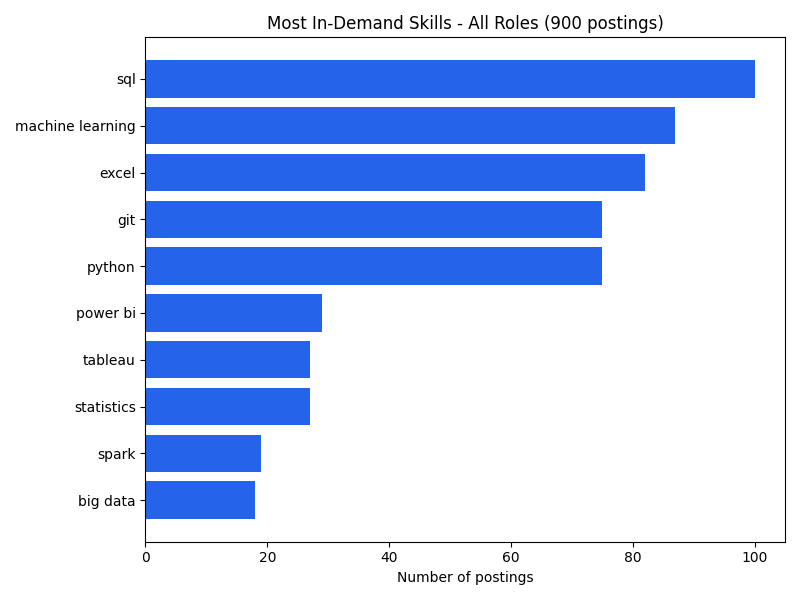
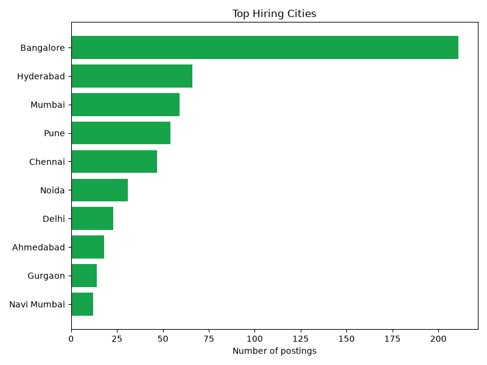
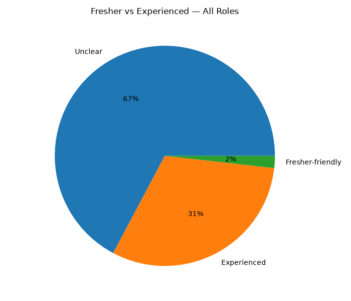
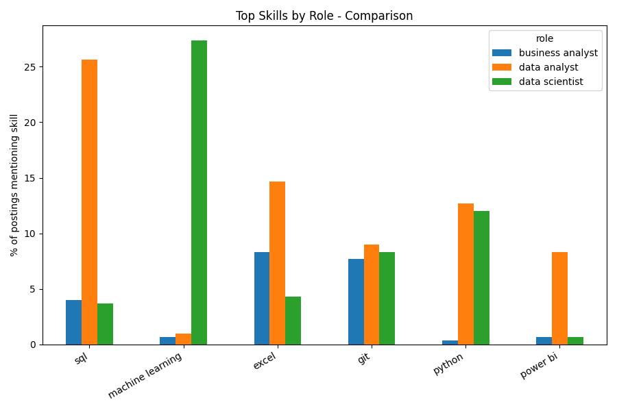
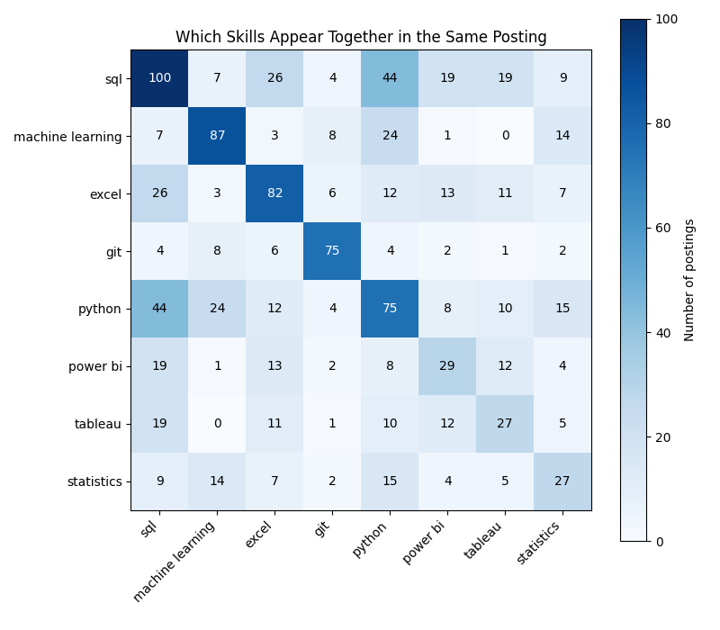

# Job Market Analysis — India (Business Analyst / Data Analyst / Data Scientist)

Analyzes ~900 live job postings across India for three roles — Business Analyst,
Data Analyst, and Data Scientist — to answer:

1. Which skills do companies ask for the most, and how does that differ by role?
2. Which cities have the most openings?
3. What share of postings are fresher-friendly vs experienced-only?
4. Which skills tend to be asked for together (e.g. SQL + Python)?

**🔗 Live Dashboard:** [job-market-analysis-19.streamlit.app](https://job-market-analysis-19.streamlit.app/)

## Why this project

Built while job-hunting for Analytics/Data roles — instead of guessing which
skills to prioritize, this pulls real posting data and answers it directly.
Data refreshes automatically every week via GitHub Actions.

## Tech Stack

- **Python** (pandas-style data processing)
- **Adzuna Job Search API** — live job posting data
- **Plotly** — interactive charts (`dashboard.html`)
- **Streamlit** — live deployed dashboard
- **GitHub Actions** — weekly automated data refresh

## Key Findings

*(from the latest data run — updates automatically every week)*

- **SQL is the single most in-demand skill**, mentioned in close to all postings —
  well ahead of Machine Learning, Excel, Git, and Python, which cluster closely
  behind it.
- **Power BI and Tableau lag far behind SQL/Python/Excel** (roughly a quarter of
  the mentions), suggesting BI tools are a differentiator rather than a baseline
  expectation.
- **Bangalore dominates hiring**, with roughly 3x the postings of the next city
  (Hyderabad), followed by Mumbai and Pune.
- **SQL + Python is the most common skill pairing**, appearing together far more
  often than any other combination — reinforcing that both are essentially
  required together, not alternatives.
- **Power BI and Tableau also co-occur frequently with each other**, suggesting
  many postings expect familiarity with BI tooling in general rather than one
  specific tool.
- **Experience-level labeling is inconsistent** — only ~30% of postings
  explicitly ask for experienced candidates, under 1% explicitly say
  "fresher," and the rest (~70%) don't specify — meaning most listings are
  worth applying to regardless of experience level unless stated otherwise.
- **Skill demand shifts by role**: Data Analyst postings lean heavily on SQL,
  Data Scientist postings lean heavily on Machine Learning, and Power BI/Tableau
  show up more for Business Analyst roles.

## Charts

<table>
<tr>
<td align="center" width="50%">
<strong>Most In-Demand Skills</strong><br><br>
<br>
<em>SQL leads by a wide margin, followed closely by Machine Learning, Excel, Git, and Python.</em>
</td>
<td align="center" width="50%">
<strong>Top Hiring Cities</strong><br><br>
<br>
<em>Bangalore alone accounts for roughly 3x the postings of the next city (Hyderabad).</em>
</td>
</tr>
<tr>
<td align="center" width="50%">
<strong>Fresher vs Experienced</strong><br><br>
<br>
<em>~70% of postings don't specify an experience level at all — worth applying regardless.</em>
</td>
<td align="center" width="50%">
<strong>Skill Demand by Role</strong><br><br>
<br>
<em>Data Analyst leans on SQL, Data Scientist leans on ML, Business Analyst leans on BI tools.</em>
</td>
</tr>
<tr>
<td align="center" colspan="2">
<strong>Skill Co-occurrence</strong><br><br>
<br>
<em>SQL + Python is by far the most common pairing — the two are essentially required together.</em>
</td>
</tr>
</table>

## Setup

1. Get a free API key from [Adzuna Developer](https://developer.adzuna.com/).
2. Install dependencies:
   ```bash
   pip install -r requirements.txt
   ```
3. Set your API credentials:
   ```bash
   export ADZUNA_APP_ID=your_app_id
   export ADZUNA_APP_KEY=your_app_key
   ```
4. Fetch postings and run the analysis:
   ```bash
   python fetch_jobs.py
   python analyze.py
   python visualize_plotly.py
   ```
5. Launch the dashboard locally:
   ```bash
   streamlit run app.py
   ```

## Project Structure

```
├── fetch_jobs.py         # pulls job postings from the Adzuna API
├── analyze.py             # skill/city/experience-level analysis + static charts
├── visualize_plotly.py    # builds the interactive Plotly dashboard (dashboard.html)
├── app.py                 # Streamlit app (live deployment)
├── requirements.txt
└── README.md
```

## Automation

A GitHub Actions workflow (`.github/workflows/update.yml`) re-fetches job data
and regenerates all charts every Monday, so the dashboard always reflects
current market data without manual work.
